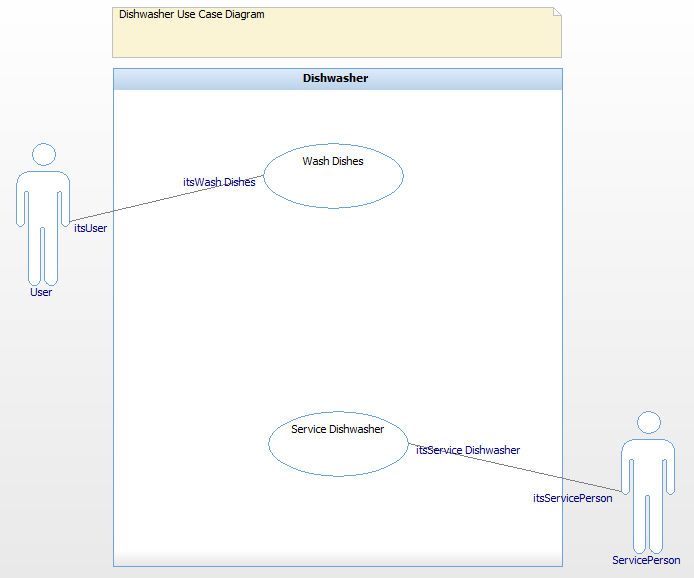
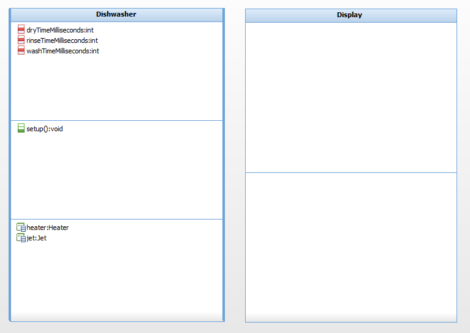

# IBM-Rhapsody-Dishwasher

 

## Spis Treści
1. [Opis](#opis)
2. [Przegląd Zawartości](#przegląd-zawartości)
3. [Informacje o Projekcie](#informacje-o-projekcie)

## Opis
To repozytorium zawiera projekt IBM-Rhapsody-Dishwasher, który jest częścią projektu inżynierskiego wykonanego na Akademii Górniczo-Hutniczej w Krakowie w ramach IMIR, APiR, Inżynieria Oprogramowania. Projekt ten jest napisany w języku Java.

## Przegląd Zawartości
W tej sekcji znajduje się przegląd zawartości katalogu "images" wraz z opisami:

### Use Case Diagram

Use case diagrams (UCDs) show the main functions of the system (use cases) and the entities that
are outside the system (actors). Use case diagrams allow you to specify the requirements for the
system and show the interactions between the system and external actors.

### Object Model Diagram

Object model diagrams (OMDs) specify the types of objects in the system, the attributes and
operations that belong to those objects, the static relationship that can exist between classes
(types), and the constraints that may apply. The Rhapsody code generator directly translates the
elements and relationships modeled in OMDs into Java source code.

## Informacje o Projekcie
- Instytucja: Akademia Górniczo-Hutnicza w Krakowie (AGH)
- Wydział: Inżynierii Mechanicznej i Robotyki (IMiR)
- Kierunek: Automatyka Przemysłowa i Robotyka (APiR)
- Przedmioty: Inżynieria Oprogramowania (IO)
